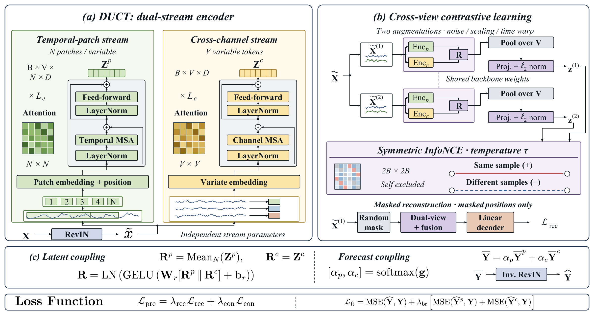

<div align="center">

# DUCT
### Dual-View Contrastive Transformer for Multivariate Time Series Forecasting

**Preserve temporal and cross-variable structure. Learn how to combine them.**


[Architecture](#architecture) · [Quick Start](#quick-start) · [Datasets](#datasets) · [Experiments](#experiments) · [Reproducibility](docs/reproducibility.md)

</div>

DUCT represents a multivariate sequence through two independent encoders: a
temporal-patch branch for within-variable dynamics and a variate branch for
cross-variable dependencies. The branches are coupled in representation space
for self-supervised pretraining and at the forecast level for prediction.

## Architecture

<p align="center">
  
</p>

| Component | Role |
| :--- | :--- |
| **Temporal-patch encoder** | Models local subsequences independently within each variable. |
| **Cross-channel encoder** | Models relationships among complete variable histories. |
| **Representation coupling** | Projects concatenated branch features into a shared representation for pretraining. |
| **Self-supervised pretraining** | Combines masked reconstruction with contrastive learning across augmented inputs. |
| **Forecast coupling** | Combines separate branch forecasts with learned softmax weights. |

The model consumes `X` with shape `[batch, variables, lookback]` and returns
forecasts with shape `[batch, variables, horizon]`.

## Quick Start

### 1. Install

Use Linux or WSL for training. The result writer uses Unix file locking
(`fcntl`), and the experiment runners use Bash.

```bash
git clone https://github.com/jordan42-arch/DUCT.git
cd DUCT
python -m venv .venv
source .venv/bin/activate
python -m pip install -r requirements.txt
```

For GPU training, select a PyTorch build compatible with your CUDA environment
using the [official installation instructions](https://pytorch.org/get-started/locally/).
On Windows, run the installation and training commands inside WSL. The
data-free model smoke tests can also run in native Windows Python.

### 2. Check the model without downloading data

```bash
python -m unittest discover -s tests -v
```

The smoke tests check forecast dimensions, learned fusion, reconstruction and
contrastive losses, finite gradients, and registered baseline forward passes.
They do not reproduce benchmark scores.

### 3. Run an ETT experiment

Place `ETTh1.csv` under `datasets/ETT-small/`, then run the stored per-horizon
configurations from the repository root:

```bash
CUDA_VISIBLE_DEVICES=0 bash scripts/comparison/ETTh1/run_ETTh1.sh
```

This runs pretraining and finetuning for horizons `96`, `192`, `336`, and `720`.
Completed cells and compatible pretraining checkpoints are reused by default.

### 4. Run the two stages explicitly

For a single ETTh1 experiment with a shared encoder configuration:

```bash
python pretrain.py \
  --data_dir datasets --datasets ETTh1 \
  --lookback 96 --patch_len 8 --stride 4 \
  --d_model 96 --n_layers 2 --d_ff 192 --dropout 0.1 \
  --epochs 20 --batch 16 --lr 1e-4 --seed 2024 \
  --mask_ratio 0.4 --mae_weight 1.0 --contrastive_weight 0.5 \
  --temperature 0.07 \
  --save_path checkpoints/quickstart/ETTh1.pt

python finetune.py \
  --data_dir datasets --dataset ETTh1 --model DUCT \
  --lookback 96 --pred_len 96 --patch_len 8 --stride 4 \
  --d_model 96 --n_layers 2 --d_ff 192 --dropout 0.1 \
  --epochs 12 --patience 6 --batch 16 --lr 5e-5 --seed 2024 \
  --branch_loss_weight 0.2 \
  --pretrained_path checkpoints/quickstart/ETTh1.pt \
  --results_dir logs/comparison/DUCT/ETTh1
```

Keep the encoder architecture arguments consistent between the two stages.
Use `python pretrain.py --help` and `python finetune.py --help` for all options.

## Datasets

The manuscript benchmark covers 18 datasets. The code additionally supports
Exchange Rate, so the all-dataset runners cover 19 datasets in total.

| Group | Datasets | Lookback | Forecast horizons |
| :--- | :--- | ---: | :--- |
| Long-term | ETTh1, ETTh2, ETTm1, ETTm2, Electricity, Traffic, Weather, Solar | 96 | 96, 192, 336, 720 |
| Short-term | PEMS03, PEMS04, PEMS07, PEMS08 | 48 | 12, 24, 36, 48 |
| Cloud workloads | FaaS and IaaS, each with Small / Medium / Large subsets | 144 | 10 |
| Additional supported dataset | Exchange Rate | 96 | 96, 192, 336, 720 |

Datasets are not bundled with this repository. Obtain the forecasting benchmarks
from the data links maintained by
[Time-Series-Library](https://github.com/thuml/Time-Series-Library),
and the cloud traces from
[ByteDance/CloudTimeSeriesData](https://huggingface.co/datasets/ByteDance/CloudTimeSeriesData).
Respect the original data terms.

```text
datasets/
  ETT-small/       ETTh1.csv, ETTh2.csv, ETTm1.csv, ETTm2.csv
  electricity/     electricity.csv
  traffic/         traffic.csv
  weather/         weather.csv
  Solar/           solar_AL.txt
  PEMS/            PEMS03.npz, PEMS04.npz, PEMS07.npz, PEMS08.npz
  exchange_rate/   exchange_rate.csv
  CloudTS/         FaaS_Small.csv, FaaS_Medium.csv, FaaS_Large.csv,
                   IaaS_Small.csv, IaaS_Medium.csv, IaaS_Large.csv
```

For cloud traces in the upstream long format (`date`, `data`, `cols`):

```bash
python scripts/data/prepare_cloudts.py \
  --raw_dir /path/to/raw_cloud_traces --out_dir datasets/CloudTS
```

The converter expects `faas.csv` and `iaas.csv`. Small and Medium subsets use a
deterministic prefix of naturally sorted instance names; see the converter for
the exact variable counts.

## Experiments

Run commands from the repository root. Set `DATA_ROOT`, `RESULT_ROOT`, or
`CHECKPOINT_ROOT` to use alternative directories where supported by the runner.

| Experiment | Command |
| :--- | :--- |
| DUCT: four ETT datasets | `bash scripts/comparison/run_ett.sh` |
| DUCT: four PEMS datasets | `bash scripts/comparison/run_pems.sh` |
| DUCT: cloud workloads | `bash scripts/comparison/CloudTS/run_cloudts.sh` |
| DUCT: all supported datasets | `bash scripts/comparison/run_all.sh` |
| Naive, DLinear, iTransformer, PatchTST and DUCT | `bash scripts/comparison/models/run_all.sh` |
| Additional baseline suite | `bash scripts/comparison/models/run_recent_tslib.sh` |

The additional suite contains TimeMixer, PAttn, WPMixer, FreTS, and TSMixer.
To select a subset:

```bash
MODELS="TimeMixer PAttn WPMixer FreTS" \
  bash scripts/comparison/models/run_recent_tslib.sh
```

Baselines use the shared data loader and evaluation path. The model registry is
in [`models/__init__.py`](models/__init__.py); these are local implementations
or adaptations, not interchangeable with every upstream configuration.
Crossformer is not yet integrated and no Crossformer scores are included.

### Outputs

Finetuning writes an aggregate `metrics.json` and a per-cell file under
`cells/<dataset>_pl<horizon>__<model>/metrics.json`. Prediction arrays are saved
only when `--save_predictions` is passed.

```bash
python scripts/comparison/make_comparison_results.py \
  --root logs/comparison --out logs/comparison_results.md
```

The comparison script reports cells excluded for missing models or inconsistent
lookback lengths. Check the exclusions before interpreting aggregate results.

### Ablations and sensitivity

```bash
CORE_CELLS="ETTm1:96" \
ABLATION_VARIANTS="full mae_only no_pretrain no_branch_aux patch_only var_only" \
  bash scripts/ablation/run_core_ablation.sh

python scripts/ablation/summarize_ablation.py --root logs/ablation/DUCT

bash scripts/parameter_analysis/run_mask_ratio_sweep.sh
bash scripts/parameter_analysis/run_temperature_sweep.sh
bash scripts/parameter_analysis/run_branch_loss_weight_sweep.sh
```

The runners include exploratory configurations beyond the manuscript tables.
Consult [reproducibility notes](docs/reproducibility.md) before using a sweep as
a paper reproduction.

## Repository Map

```text
models/              DUCT and baseline implementations
layers/              Embeddings, encoders, RevIN, augmentation, forecast heads
data_provider/       Dataset registry, chronological splits, train-only scaling
exp/                 Pretraining and finetuning loops
scripts/comparison/  Dataset-specific configurations and baseline runners
scripts/ablation/    Ablation runners and summaries
scripts/parameter_analysis/  Hyperparameter sweeps
tests/               Data-free CPU smoke tests
docs/                Architecture and reproducibility notes
third_party/         Attribution and upstream licenses
```

## Acknowledgments

This work builds on ideas and implementations from
[iTransformer](https://github.com/thuml/iTransformer),
[PatchTST](https://github.com/yuqinie98/PatchTST),
[Time-Series-Library](https://github.com/thuml/Time-Series-Library), and the
baseline papers. WPMixer and its DWT routines retain their upstream attribution.
See [third-party notices](THIRD_PARTY_NOTICES.md) for source links and licenses.

## Contact

For reproducibility questions, please
[open an issue](https://github.com/jordan42-arch/DUCT/issues) with the command,
dataset, software versions, and traceback. Do not include credentials or private
data. Until a final paper citation is available, refer to this repository and
the commit used for the experiment.
